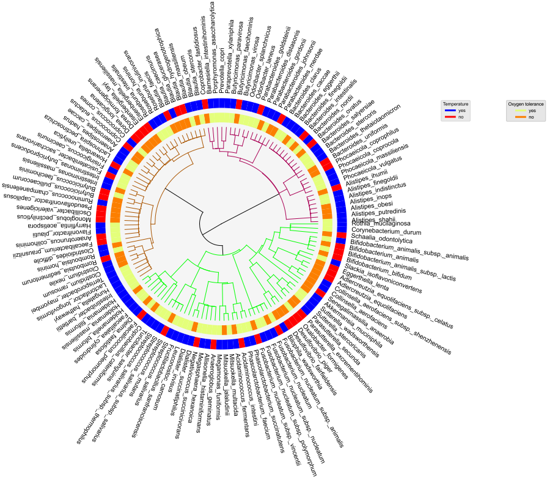
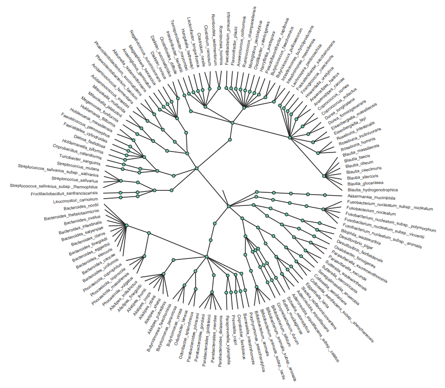
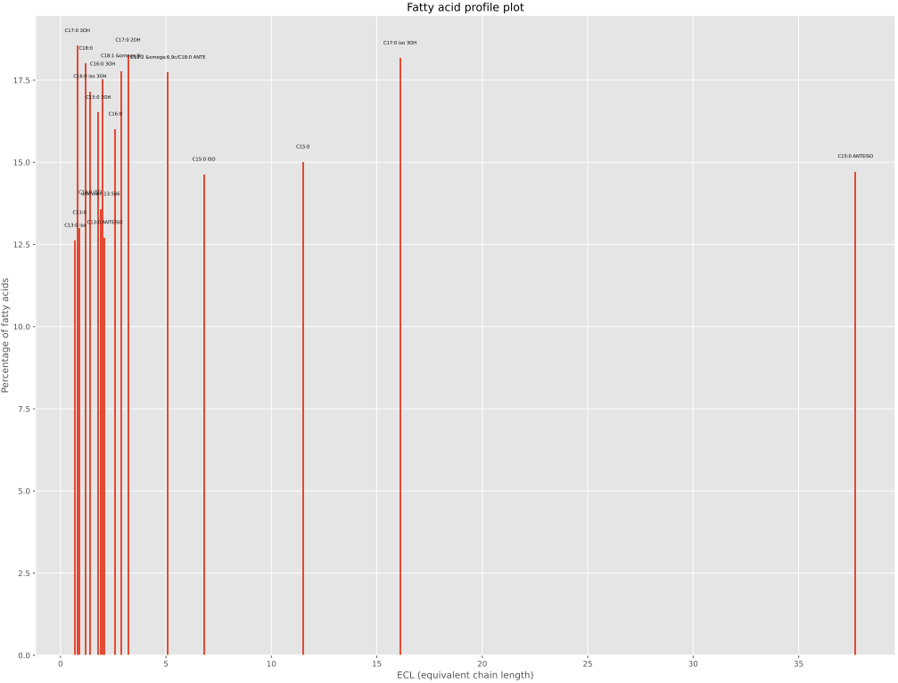
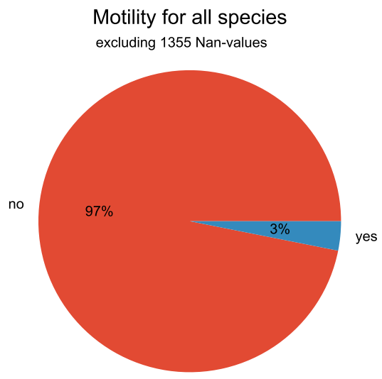
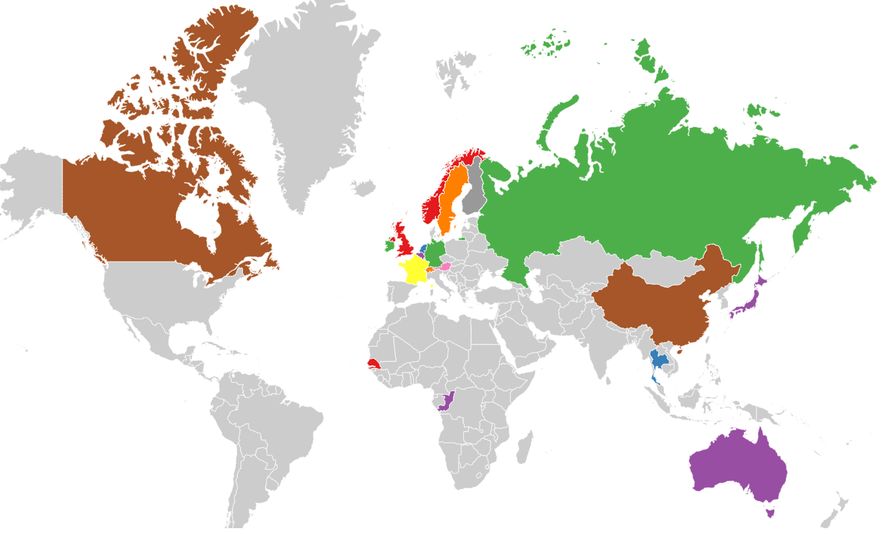
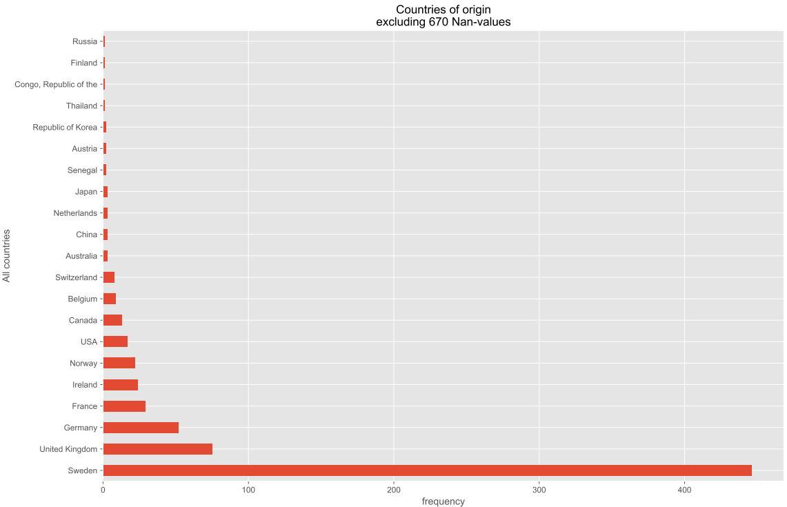
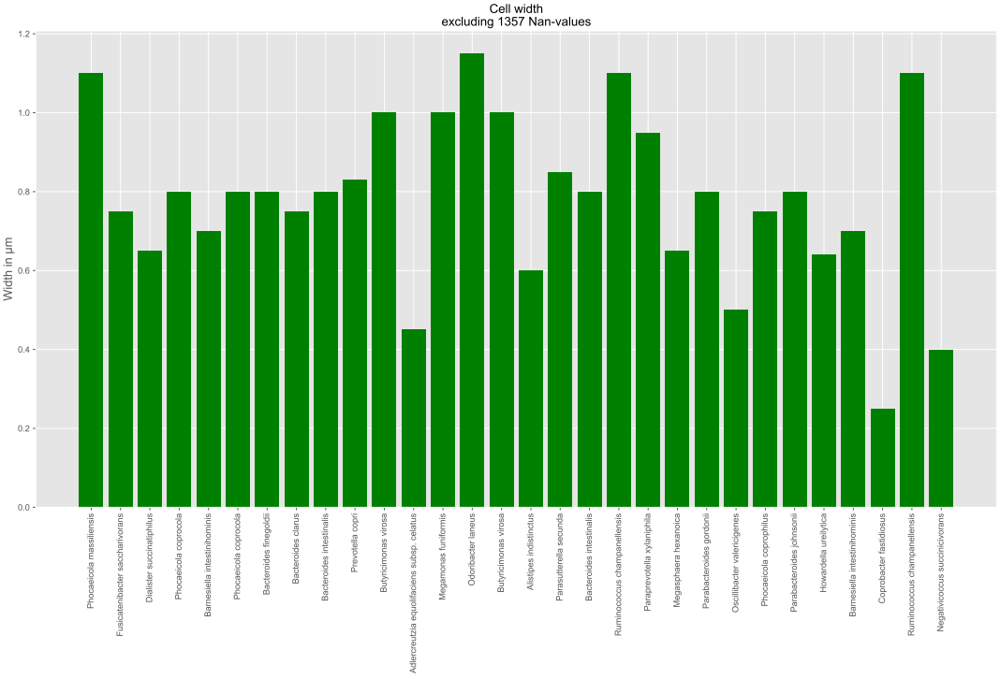
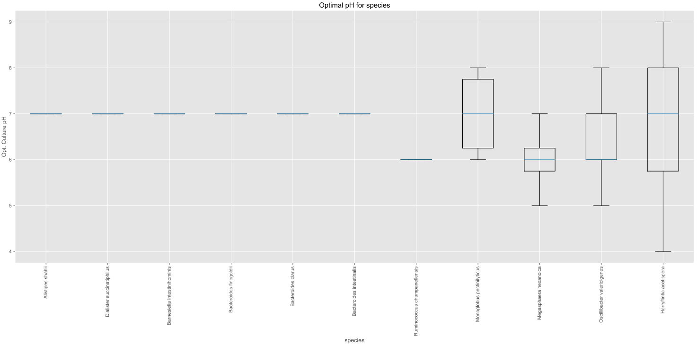
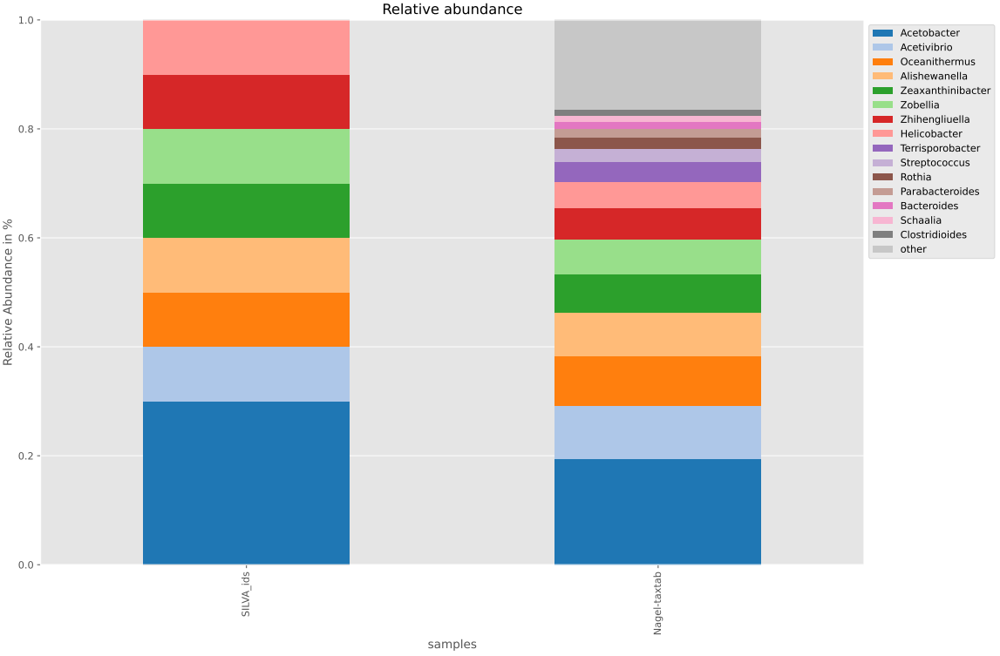

Tutorial
========

We start by importing Bacdiving:

.. code-block:: python

	from bacdiving import bacdive_caller as bc
   	from bacdiving import treeplots_maker as tm
   	from bacdiving import visualizations_maker as vm

Now assume we have the following taxonomy table taxtab.tsv (which we prior extracted from a phyloseq-object):

.. csv-table:: taxtab.tsv
   :header: " ", "Kingdom", "Phylum", "Class", "Order", "Family", "Genus", "Species"
   :widths: 15, 20, 20, 20, 20, 20, 20, 20

   "ASV1", "Bacteria",	"Bacteroidota",	"Bacteroidia",	"Bacteroidales", "Bacteroidaceae", "Bacteroides", "vulgatus"
   "ASV2", "Bacteria", 	"Firmicutes",	"Clostridia",	"Lachnospirales", "Lachnospiraceae",	"Blautia", "NA"
   "ASV3", "Bacteria",	"Bacteroidota",	"Bacteroidia",	"Bacteroidales", "Bacteroidaceae", "Bacteroides", "NA"
   "ASV4", "Bacteria",	"Bacteroidota",	"Bacteroidia",	"Bacteroidales", "Bacteroidaceae", "Bacteroides", "uniformis"
   "ASV5", "Bacteria",	"Firmicutes",	"Clostridia",	"Oscillospirales", "Ruminococcaceae",	"Faecalibacterium", "NA"

.. note:: This taxonomy table stems from Nagel et al. (2016) but you can use any taxonomy table in this .tsv format to follow along with this tutorial. For demonstration purposes this table only shows the first 5 rows of the taxonomy table. 

.. warning:: Note how species-level information is simply not always known for all ASVs in a taxonomy table. On average, you can expect 80% - 95% of all species from a given taxonomy table to be documented in BacDive. The exact percentage is mentioned in the access statistics output file which is generated after running :py:func:`bacdiving.bacdive_call()`.

To get the resulting dataframe with all strain-level BacDive information for all the species in this taxonomy table you can run:

.. code-block:: python

	# Run for single taxonomy table input (e.g. as extracted from phyloseq-object)
	resulting_list_with_all_res_dfs = bc.bacdive_call(bacdive_id="<your ID>", bacdive_password="<your password>", inputs_list=["./taxtab.tsv taxtable_input"], sample_names=["taxtab"], print_res_df_ToFile = True, print_access_stats = True, print_flattened_file=True, columns_of_interest=["Physiology and metabolism.oxygen tolerance.oxygen tolerance", "Culture and growth conditions.culture temp.temperature", "Isolation, sampling and environmental information.isolation.origin.country","Morphology.cell morphology.motility"], output_dir="./") 
	resulting_df = resulting_list_with_all_res_dfs[0]

.. warning:: If you set ``"print_flattened_file"`` to True, then make sure your ``"columns_of_interest"`` contain meaningful BacDive features. For example, "General.BacDive-ID" or "General.description" would not be a smart choice as the majority value over all strains per species will be written to the flattened output file. Also, columns like "Culture and growth conditions.culture pH" may not be a good choice as this is typically a column with mixed types (neither fully categorical nor numerical). If you are interested in obtaining information from such columns with mixed types, use rather other functions like :py:func:`bacdiving.get_resulting_df_values()`. Thus, you should use columns like the ones above instead, which will print the majority value (which is not nan) for a given BacDive feature across all strains per species.

Assuming you do not have a taxonomy table, but have a simple file as input instead which looks something like this:

.. csv-table:: SILVA_ids.txt
   :widths: 15

   "AB681649"
   "AB121974"
   "EU847536"
   "D30768"
   "L35516"
   "AB681086"
   "AB052706"
   "AF144407"
   "AF363064"
   "AJ430586"  

.. note:: For demonstration purposes this SILVA_ids.txt file only contains 10 SILVA-ids. Note that other input types for querying BacDive are possible as well, e.g. taxonomy (as in a list of all species names of interest), Bacdive-ids, culture collection ids or genome accession ids. However, it is important that a single file can not contain multiple input types. 

Given your input file, you can run the following, depending on your input type:

.. code-block:: python

	# Run for a single input from text file for SILVA id queries
	resulting_list_with_all_res_dfs = bc.bacdive_call(bacdive_id="<your ID>", bacdive_password="<your password>", inputs_list=["./SILVA_ids.txt input_via_file search_by_16S_seq_accession"], sample_names=["SILVA"], output_dir="./")
	resulting_df = resulting_list_with_all_res_dfs[0]   

	# Run for a single input from text file for taxonomy queries
	resulting_list_with_all_res_dfs = bc.bacdive_call(inputs_list=["./taxonomy_ids.txt input_via_file search_by_taxonomy"], sample_names=["taxonomy"], output_dir="./results/") # if credentials are not given via parameters, you will get prompted
	resulting_df = resulting_list_with_all_res_dfs[0] 

	# Run for a single input from text file for BacDive id queries
	resulting_list_with_all_res_dfs = bc.bacdive_call(bacdive_id="<your ID>", bacdive_password="<your password>", inputs_list=["./bacdive_ids.txt input_via_file search_by_id"], sample_names=["bacdive"], output_dir="./")
	resulting_df = resulting_list_with_all_res_dfs[0] 

	# Run for a single input from text file for culture collection queries
	resulting_list_with_all_res_dfs = bc.bacdive_call(bacdive_id="<your ID>", bacdive_password="<your password>", inputs_list=["./culture_col_ids.txt input_via_file search_by_culture_collection"], sample_names=["culturecol"], output_dir="./")
	resulting_df = resulting_list_with_all_res_dfs[0]  

	# Run for a single input from text file for genome accession queries
	resulting_list_with_all_res_dfs = bc.bacdive_call(bacdive_id="<your ID>", bacdive_password="<your password>", inputs_list=["./genome_ids.txt input_via_file search_by_genome_accession"], sample_names=["genomecol"], output_dir="./") 
	resulting_df = resulting_list_with_all_res_dfs[0]

If you have multiple inputs of possibly different input types, you can run the following command:

.. code-block:: python

	# Run for multiple inputs (of possibly different input types)
	resulting_list_with_all_res_dfs = bc.bacdive_call(bacdive_id="<your ID>", bacdive_password="<your password>", inputs_list=["./SILVA_ids.txt input_via_file search_by_16S_seq_accession", "./taxonomy_ids.txt input_via_file search_by_taxonomy", "./taxtab1.tsv taxtable_input", "./taxtab2.tsv taxtable_input"], sample_names=["sample1", "sample2", "sample3", "sample4"], print_flattened_file=True, columns_of_interest=["Physiology and metabolism.oxygen tolerance.oxygen tolerance", "Culture and growth conditions.culture temp.temperature"])
	resulting_df = resulting_list_with_all_res_dfs[1]  # pick your dataframe of interest from this list

Now that you have the resulting dataframe at hand, you are almost ready to start visualizing the data. 

.. warning:: If you try to plot information for a column which is not present in the resulting dataframe or if your parameters are set incorrectly or do not match the resulting dataframe, you may get an error. So, make sure to get to know your resulting dataframe (and especially its columns) beforehand.

Let's first take a look at the resulting dataframe:

.. code-block:: python

	#Dataframe exploration
   	print(resulting_df.head()) # prints head of resulting dataframe
  	print(len(resulting_df.index)) #print number of resulting_df rows
   	print(resulting_df.keys())  #print resulting_df column names
   	print(resulting_df.iloc[0:5, 2:4]) #print all specific column information via column index
   	print(resulting_df["Physiology and metabolism.oxygen tolerance.oxygen tolerance"].unique()) #print unique values in a given column
   	print(resulting_df.loc[resulting_df["Name and taxonomic classification.species" ] == "Bacteroides uniformis"])  # print all strains and all columns for Bacteroides uniformis from resulting_df
   	print(resulting_df.loc[resulting_df["Name and taxonomic classification.species"] == "Helicobacter pylori"]["Culture and growth conditions.culture temp"])  # print all strains for column "Culture and growth conditions.culture temp" for Helicobacter pylori from resulting_df
   	print(resulting_df.loc[(resulting_df["Name and taxonomic classification.species"] == "Helicobacter pylori") & (resulting_df["Isolation, sampling and environmental information.isolation.country"] == "Germany")]) #Subset resulting_df to certain parameters
   	print(len(resulting_df.loc[resulting_df["Name and taxonomic classification.species"] == 'Zhihengliuella alba'].index)) #find out how many strains are present for a given species
   	print(get_resulting_df_values(resulting_df, "Culture and growth conditions.culture pH", "pH", species_list=["Helicobacter pylori", "Bacteroides clarus", "Actinomyces odontolyticus", "Bacteroides salyersiae", "Zhihengliuella alba"])) #Given a list of species of interest, access elements in resulting_df which are nested

Great, now we know the basic structure of our resulting dataframe and what kind of BacDive information we have, so it is finally time to start plotting! 

.. note:: There are many possibilites for which columns from the resulting dataframe can be plotted for each plotting function. This tutorial shall only demonstrate a few examples.

.. warning:: Since we are dealing with strain-level information per species, please be aware when investigating your plotting results that BacDive information does not neccessarily exist for all strains. 

In order to first gain some overview of our data, let us start with Bacdiving's overview treeplot. Assume we want to know for which species BacDive information on temperature and oxygen tolerance is known or not. We can do this by running the following command:

.. code-block:: python

	#Overview treeplot
	tm.overview_treeplot(resulting_df, label_name1="Temperature", label_name2="Oxygen tolerance", saveToFile=True, output_dir="./")

This results in the following plot:

If you do not want the BacDive information to be shown and just prefer the hierarchical taxonomy tree plot, then run:

.. code-block:: python

	#Circular treeplot
	tm.circular_treeplot(resulting_df, output_dir="./")

This results in the following plot:

Let's say we are interested in generating a fatty acid profile plot for "Achromobacter denitrificans":

.. code-block:: python

	#Fatty acid profile plot
	vm.fatty_acid_profile(resulting_df, species = "Achromobacter denitrificans",  figsize=[20, 15], saveToFile=True, output_dir="./")

This results in the following plot:

We can also make pie plots to look at the motility of our species:

.. code-block:: python

	#Pie plot
	vm.pieplot_maker(resulting_df,"Morphology.cell morphology.motility", title="Motility for all species", saveToFile = True, output_dir="./")

This results in the following plot:

If we are interesting in knowing from which countries the species in our dataset originate from we can create a world map:

.. code-block:: python

	#World map
	vm.worldmap_maker(resulting_df)

This results in the following plot:

Going from this world map if we want to know which country is the most frequent, we can run:

.. code-block:: python

	#Frequency plot
	vm.freqplot_maker(resulting_df, "Isolation, sampling and environmental information.isolation.country", title="Countries of origin", ylabel_name = "All countries", saveToFile=True, output_dir="./")

This results in the following plot:

Next, we want to make a bar plot to visualize the differences in cell width across various species:

.. code-block:: python

	#Species list for ALL species in resulting_df, not for a subset
	species_list = resulting_df["Name and taxonomic classification.species"].tolist()

	#Barplot
        vm.barplot_maker(resulting_df, "Morphology.cell morphology.cell width", "Cell width", "Width in µm", figsize=[20,10], species_list=species_list, saveToFile=True, output_dir="./")

This results in the following plot:

Let's make a boxplot which shows the optimal pH range for all the species in our dataset:

.. code-block:: python

	#Species list for ALL species in resulting_df, not for a subset
	species_list = resulting_df["Name and taxonomic classification.species"].tolist()

	#Boxplot
   	value_dict = vm.access_list_df_objects(resulting_df, "Culture and growth conditions.culture pH", "pH", pH= 1, species_list=species_list)
   	vm.boxplot_maker(value_dict, title= "Optimal pH for species", xlabel_name= "species", ylabel_name="Opt. Culture pH",figsize=[20, 10], saveToFile=True, output_dir="./")

	
This results in the following plot:

Lastly, we can compare the relative abundances of e.g. the genera for our SILVA-ids.txt and our taxonomy table input in a stacked bar plot:

.. code-block:: python

	# Run for multiple inputs
	resulting_list_with_all_res_dfs = bc.bacdive_call(input_lists={"./SILVA_ids.txt" : ["input_via_file", "search_by_16S_seq_accession"], "./taxtab.tsv" : ["taxtable_input"]},sample_names=["SILVA_ids", "Nagel_taxtab"])
	#Relative abundance plot
	vm.stacked_barplot_relative_abundance(resulting_list_with_all_res_dfs, sample_names=["SILVA_ids", "Nagel_taxtab"], plot_column="Name and taxonomic classification.genus", title="Relative abundance", saveToFile = True, output_dir="./")
 
This results in the following plot:

In effect, this plot shows us the genera composition for all those species (for which BacDive information is available) in the resulting dataframe.

.. note:: A `Qiime2 <https://qiime2.org/>`_ plugin named q2-bacdiving has also been created which implements the function :py:func:`bacdiving.bacdive_call()` and can be `found here <https://github.com/mBiocoder/q2_bacdiving>`_.

This concludes this tutorial for Bacdiving but feel free to use the resulting dataframe to either generate your own custom visualizations or to use it as an input for other tools like `NetCoMi <https://github.com/mBiocoder/Bacdiving/tree/main/examples/NetCoMi>`_.  

