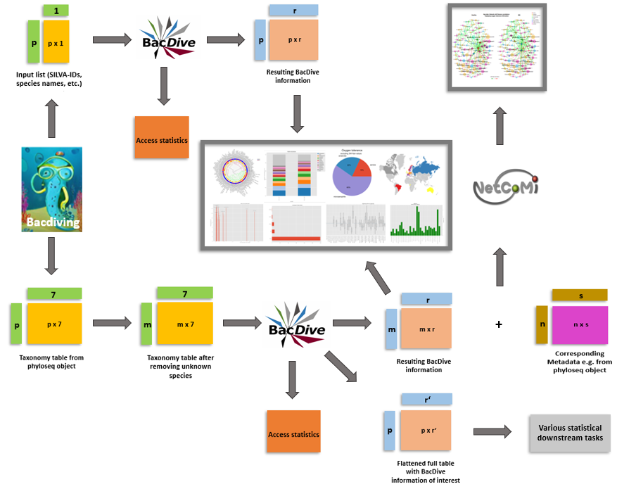

Usage
=====

About Bacdiving
---------------

Bacdiving is a Python package which can access and retrieve information from the world’s largest database for standardized bacterial phenotypic information: `BacDive <https://bacdive.dsmz.de/>`_.
Additionally, Bacdiving provides access statistics and options to visualize this information.

The following figure gives an overview of Bacdiving and how this package could be used:

As depicted in this workflow, Bacdiving can deal with two types of inputs: either a taxonomy
table (e.g. resulting from a phyloseq-object) or a file input.

Let us begin with the file input type (in p x 1 format). The
file can contain p rows of either all BacDive-IDs, culture collection numbers, taxonomy
information (either as full name or as list with genus name, species with optional epithet,
and optional subspecies) or sequence accession numbers (either 16S sequences, SILVA-IDs
or genome sequences). For each one of the p rows BacDive is then queried and all strain-level information is stored in a single dataframe.
This resulting dataframe is of the format p x r with r being the number
of BacDive columns for which we have information. 
This dataframe, along with the corresponding access statistics, can then be written to file. All other core functions in BacDiving rely on the resulting dataframe.

The second possible input type is a taxonomy table (in p x 7 format) which has the following 7 taxonomic ranks: kingdom, phylum, class, order, family, genus, species.
Bacdiving first filters out all rows for which the species is unknown. This results in a
”new” taxonomy table (in m x 7 format). Each one of these m species will then be checked
if it can be found on BacDive or not. If information is available for a given species, then BacDive data for all of its known strains will be
appended into a single dataframe. In the end, this resulting dataframe (m x r) will contain all strain-level information for all species of the taxonomy table. Thus, the resulting dataframe and the 
corresponding BacDive access statistics results can be written to file. Additionally, given a taxonomy table as input, one may wish to see Bacdive information across all strains of a given species in order to perform 
various other downstream statistical tasks (e.g. matrix completion, regression, etc.). Therefore, given specific BacDive features of interest, a flattened file (in p x r' format) can be outputted which contains the number
of strains per species found on BacDive as well as the majority values across all strains for given BacDive features of interest.

Depending on the research question, either BacDiving’s visualization options can be used
or custom visualizations can be made using the resulting dataframe. There is really no limit on
how you can extend and make use of the resulting dataframe.

For instance, this resulting dataframe along with metadata and the corresponding ASV
table could be used in tools like `NetCoMi <https://github.com/stefpeschel/NetCoMi>`_ to construct various types of networks.
The nodes of these networks could be colored with specific phylogenetic information from
BacDive as stored in the resulting dataframe file which in turn may explain why a given
network looks the way it does. In other words, coloring the nodes in a network based on
phylogentic information may explain the correlation between various features.

Accessing BacDive
-----------------

As soon as you have registered on BacDive, you can use your credentials to run Bacdiving’s most central function :py:func:`bacdiving.bacdive_call()`:
 
.. py:function:: bacdiving.bacdive_call(bacdive_id =" ", bacdive_password =" ", inputs_list = [" "], sample_names = [" "], print_res_df_ToFile = True, print_access_stats = True, print_flattened_file = False,  columns_of_interest = [" "], output_dir ="./")

    Reads the inputs, queries the BacDive database and stores resulting dataframe(s) and access statistics.

   :param bacdive_id: Log in credential: BacDive id.
   :type bacdive_id: str
   :param bacdive_password: Log in credential: BacDive password.
   :type bacdive_password: str
   :param inputs_list: List which specifies (multiple) strings. Each string has the structure: "<file-path> <file-type> (<content-type>)" and is thus seperated by space(s). Content-type is, however, only required if you have input_via_file; it can have one of the following values: "search_by_id", "search_by_culture_collection", "search_by_taxonomy", "search_by_16S_seq_accession" or "search_by_genome_accession".
   :type inputs_list: list[str]
   :param sample_names: List of sample names.
   :type sample_names: list[str]
   :param print_res_df_ToFile: Print the resulting dataframe with all Bacdive information to file or not.
   :type print_res_df_ToFile: bool
   :param print_access_stats: Print the Bacdive access statistics to file or not.
   :type print_access_stats: bool
   :param print_flattened_file: Print the flattened Bacdive information for certain columns of interest to file or not.
   :type print_flattened_file: bool
   :param columns_of_interest: Specify in this list which columns from BacdiveInformation.tsv you want to include in the flattened file.
   :type columns_of_interest: list[str]
   :param output_dir: Path to where resulting dataframe should be saved.
   :type output_dir: str
   :return: List containing the resulting dataframe(s)  with all strain-level BacDive information for all inputs.
   :rtype: list[pandas.DataFrame]

The first thing :py:func:`bacdiving.bacdive_call()` does is, it will prompt you to input your login credentials prior to querying BacDive, if you did not input your credentials via the function parameters ``"bacdive_id"`` and ``"bacdive_password"``. 

After that, it generates the resulting dataframe(s) (BacdiveInformation.tsv) with all strain-level information and 
it can output the BacDive access statistics (if the parameter is set) as a .txt-file which gives information on the percentage of input
species found on BacDive and also lists all species which could not be found on BacDive. Additional files (like Species_names_from_taxtable_file.csv or Flattened_Bacdive_data.tsv) may as well be outputted if your input was a taxonomy table. Note that the file Species_names_from_taxtable_file.csv lists all species from the taxonomy table, even prior to querying BacDive.

For accessing specific data entries in your resulting dataframe you can either run :py:func:`bacdiving.get_resulting_df_values()` or :py:func:`bacdiving.access_list_df_objects()`. 

.. py:function:: bacdiving.get_resulting_df_values(resulting_df, plot_column = " ", plot_category = " ", species_list = [" "])

    Access all categories of interest only for a column of interest from the resulting dataframe.

   :param resulting_df: Resulting dataframe as outputted by bacdive_call().
   :type resulting_df: pandas.DataFrame
   :param plot_column: Column of interest from resulting_df.
   :type plot_column: str
   :param plot_category: Category of interest from column of interest from resulting_df.
   :type plot_category: str
   :param species_list: List of species.
   :type species_list: list[str]
   :return: Dictionary: <species> : <values>

 
.. py:function:: bacdiving.access_list_df_objects(resulting_df, plot_column = " ", plot_category = " ", temp = 0, pH = 0, halophily = 0, species_list = [" "])

    Access all categories of interest only for the pH, temperature and halophily columns from the resulting dataframe.

   :param resulting_df: Resulting dataframe as outputted by bacdive_call().
   :type resulting_df: pandas.DataFrame
   :param plot_column: Column of interest from resulting_df.
   :type plot_column: str
   :param plot_category: Category of interest from column of interest from resulting_df.
   :type plot_category: str
   :param temp: Either one of temp, pH or halophily can be accessed. If temp = 1, temp will be accessed.
   :type temp: int
   :param pH: Either one of temp, pH or halophily can be accessed. If pH = 1, pH will be accessed.
   :type pH: int
   :param halophily: Either one of temp, pH or halophily can be accessed. If halophily = 1, halophily will be accessed.
   :type halophily: int
   :param species_list: List of species.
   :type species_list: list[str]
   :return: Dictionary: <species> : <values>

However, :py:func:`bacdiving.access_list_df_objects()` is only designed to be used if you are interested in retrieving information for either pH, temperature or halophily (e.g. prior to making a box plot), whereas :py:func:`bacdiving.get_resulting_df_values` is more generic.

Visualizations
--------------

Bacdiving supports 8 different visualization types:

1. Circular hierarchical taxonomic tree plot (also referred to as overview tree plot since it gives information on which species have what kind of BacDive information):

.. py:function:: bacdiving.overview_treeplot(resulting_df, pallete = "brg", colormap1 = "bwr", column_name1 = "Culture and growth conditions.culture temp.temperature", column_name2 = "Physiology and metabolism.oxygen tolerance.oxygen tolerance", label_name1 = "Category1", label_name2 = "Category2", colormap2 = "Wistia", fontsize = 14, figsize = [20,10], saveToFile = True, output_dir = "./")

    Makes overview tree plot showing hierarchical tree structure for all species of input as well as maximum 2 BacDive columns of interest.

   :param resulting_df: Resulting dataframe as outputted by bacdive_call().
   :type resulting_df: pandas.DataFrame
   :param pallete: Color palette used.
   :type pallete: str
   :param colormap1: Color map used for first column of interest.
   :type colormap1: str
   :param column_name1: First column of interest from resulting_df to plot.
   :type column_name1: str
   :param column_name2: Second column of interest from resulting_df to plot.
   :type column_name2: str
   :param label_name1: Legend label for first column of interest.
   :type label_name1: str
   :param label_name2: Legend label for second column of interest.
   :type label_name2: str
   :param colormap2: Color map for second column of interest.
   :type colormap2: str
   :param fontsize: Size of font.
   :type fontsize: int
   :param figsize: Size of plot.
   :type figsize: [x, y] array-like of floats
   :param saveToFile: Save plot or not.
   :type saveToFile: bool
   :param output_dir: Path where plot should be saved.
   :type output_dir: str
   :return: Overview plot

A similar circular hierarchical tree plot but without showing BacDive information can be created as well:

.. py:function:: bacdiving.circular_treeplot(resulting_df, width = 1400, height = 1400, saveToFile = True, output_format ="pdf", output_dir ="./")

    Makes tree plot showing hierarchical tree structure for all species of input.

   :param resulting_df: Resulting dataframe as outputted by bacdive_call().
   :type resulting_df: pandas.DataFrame
   :param width: Width of tree plot.
   :type width: int
   :param height: Height of tree plot.
   :type height: int
   :param saveToFile: Save plot or not.
   :type saveToFile: bool
   :param output_format: Output file type. Possible file formats include: pdf, svg and html.
   :type output_format: str
   :param output_dir: Path where plot should be saved.
   :type output_dir: str
   :return: Circular treeplot

2. Stacked bar plot to show relative abundance (of e.g. different genera) per sample:

.. py:function:: bacdiving.stacked_barplot_relative_abundance(resulting_df, top_x = 15, sample_names = [" "], plot_column =" ", title =" ", title_label = " ", saveToFile = True, output_dir ="./", figsize = [15, 10])

    Makes stacked bar plot for any taxonomy level from resulting dataframe.

   :param resulting_df: Resulting dataframe as outputted by bacdive_call().
   :type resulting_df: pandas.DataFrame
   :param top_x: Limit for how many different color categories should be seen in the plot.
   :type top_x: int
   :param sample_names: List of names for each sample.
   :type sample_names: list[str]
   :param plot_column: Taxonomy level of interest (e.g. Name and taxonomic classification.genus).
   :type plot_column: str
   :param title: Title for this plot.
   :type title: str
   :param title_label: Title for legend (e.g. Genus).
   :type title_label: str
   :param saveToFile: Save plot or not.
   :type saveToFile: bool
   :param output_dir: Path where plot should be saved.
   :type output_dir: str
   :param figsize: Size of the resulting plot.
   :type figsize: [x, y] array-like of floats
   :return: Stacked bar plot

3. Pie chart to plot information like oxygen tolerance:

.. py:function:: bacdiving.pieplot_maker(resulting_df, plot_column, title = " ", ylabel_name = " ", saveToFile = False, output_dir = "./", figsize = [6.4, 4.8])

    Makes pie plot for columns of interest from resulting dataframe.

   :param resulting_df: Resulting dataframe as outputted by bacdive_call().
   :type resulting_df: pandas.DataFrame
   :param plot_column: Column of interest from resulting_df.
   :type plot_column: str
   :param title: Title for this plot.
   :type title: str
   :param ylabel_name: y-axis label name.
   :type ylabel_name: str
   :param saveToFile: Save plot or not.
   :type saveToFile: bool
   :param output_dir: Path where plot should be saved.
   :type output_dir: str
   :param figsize: Size of the resulting plot.
   :type figsize: [x, y] array-like of floats
   :return: Pie plot

4. World map to show all countries (not water bodies!) of origin for a given set of species:

.. py:function:: bacdiving.worldmap_maker(resulting_df)

    Makes world map displaying all countries where species from the input originate from.

   :param resulting_df: Resulting dataframe as outputted by bacdive_call().
   :type resulting_df: pandas.DataFrame
   :return: World map

5. Fatty acid profile plot for a fatty acid of interest:

.. py:function:: bacdiving.fatty_acid_profile(resulting_df, species = "", title = "Fatty acid profile plot", figsize= [10, 10], barwidth = 0.05, fontsize = 6, saveToFile = True, output_dir = "./")

    Makes fatty acid profile plot for any one fatty acid of interest of interest from resulting dataframe.

   :param resulting_df: Resulting dataframe as outputted by bacdive_call().
   :type resulting_df: pandas.DataFrame
   :param species: Species of interest (e.g. Bacteroides vulgatus).
   :type species: str
   :param title: Title for this plot.
   :type title: str
   :param figsize: Size of the resulting plot.
   :type figsize: [x, y] array-like of floats
   :param barwidth: Width of the bars.
   :type barwidth: float
   :param fontsize: Size of the font.
   :type fontsize: int
   :param saveToFile: Save plot or not.
   :type saveToFile: bool
   :param output_dir: Path where plot should be saved.
   :type output_dir: str
   :return: Fatty acid profile plot

6. Frequency plot (of e.g. most frequent sampling type):

.. py:function:: bacdiving.freqplot_maker(resulting_df, plot_column = " ", title = " ", ylabel_name = " ", saveToFile=False, output_dir = "./", figsize = [15, 10])

    Makes frequency plot for column of interest from resulting dataframe.

   :param resulting_df: Resulting dataframe as outputted by bacdive_call().
   :type resulting_df: pandas.DataFrame
   :param plot_column: Column of interest from resulting_df.
   :type plot_column: str
   :param title: Title for this plot.
   :type title: str
   :param ylabel_name: y-axis label name.
   :type ylabel_name: str
   :param saveToFile: Save plot or not.
   :type saveToFile: bool
   :param output_dir: Path where plot should be saved.
   :type output_dir: str
   :param figsize: Size of the resulting plot.
   :type figsize: [x, y] array-like of floats
   :return: Frequency plot

7. Box plot to compare e.g. optimal temperature ranges for various species

.. py:function:: bacdiving.boxplot_maker(resulting_dict, title = " ", xlabel_name = " ", ylabel_name = " ", saveToFile = False, output_dir = "./", figsize = [15, 10])

    Makes box plot given a dictionary with values of interest.

   :param resulting_dict: Dictionary input with values (e.g. temperature or pH).
   :type resulting_dict: dict
   :param title: Title for this plot.
   :type title: str
   :param xlabel_name: x-axis label name.
   :type xlabel_name: str
   :param ylabel_name: y-axis label name.
   :type ylabel_name: str
   :param saveToFile: Save plot or not.
   :type saveToFile: bool
   :param output_dir: Path where plot should be saved.
   :type output_dir: str
   :param figsize: Size of the resulting plot.
   :type figsize: [x, y] array-like of floats
   :return: Box plot

8. Bar plot to compare e.g. cell length of different species
 
.. py:function:: bacdiving.barplot_maker(resulting_df, plot_column = " ", title = " ", ylabel_name = " ", xlabel_name = " ", color= "green", species_list = [], saveToFile=False, output_dir = "./", figsize = [15,10])

    Makes bar plot for any continuous column of interest from resulting dataframe.

   :param resulting_df: Resulting dataframe as outputted by bacdive_call().
   :type resulting_df: pandas.DataFrame
   :param title: Title for this plot.
   :type title: str
   :param ylabel_name: y-axis label name.
   :type ylabel_name: str
   :param xlabel_name: x-axis label name.
   :type xlabel_name: str
   :param color: Color of bars.
   :type color: str
   :param species_list: List of species of interest.
   :type species_list: list[str]
   :param saveToFile: Save plot or not.
   :type saveToFile: bool
   :param output_dir: Path where plot should be saved.
   :type output_dir: str
   :param figsize: Size of the resulting plot.
   :type figsize: [x, y] array-like of floats
   :return: Bar plot

